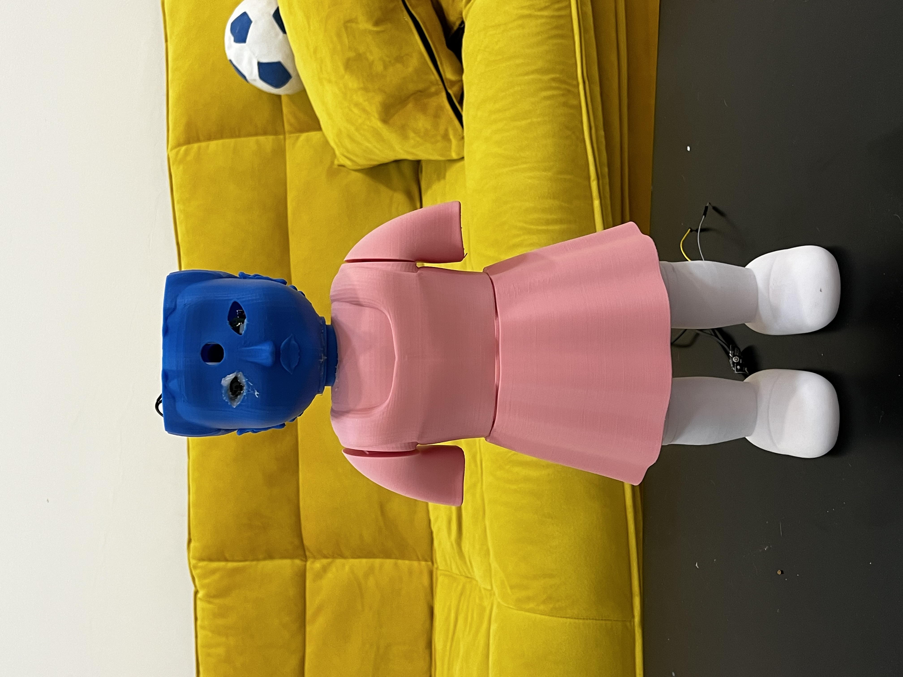

# Younghee: The Squid Game Doll Project

Younghee is inspired by the spine-chilling doll from the popular show Squid Game. The doll plays "Green Light, Red Light" and detects motion using object recognition technology. If you're intrigued by the idea of having a creepy, yet fascinating, piece of technology in your room, you're in the right place!

## Overview:
This project leverages the MobileNet SSD Caffe model for object recognition to detect human movement through a simplified script.

## Ussage:
If you're interested in recreating this project, you're welcome to do so! Feel free to reach out if you encounter any issues.

### 3D Printing the Parts
All the 3D models used in this project are available in this repository. Note that the arm designs are still in progress. If you design them, please contribute by making a pull request. I'd be thrilled to include your designs!

### Using the code:

#### Python code:
The initial goal was to have a standalone robot, hence the space for an Nvidia Jetson Nano inside the doll's torso. Unfortunately, my Jetson got damaged, so I switched to an external laptop and Arduino setup. Either way, the setup is straightforward. Install the required libraries using:
```bash
pip install -r requirements.txt
```
Then simply run the code:

```bash
 python3 main.py --prototxt MobileNetSSD_deploy.prototxt.txt --model MobileNetSSD_deploy.caffemodel
 ```

#### Ardunio code:

The Arduino code is straightforward. I used a continuous servo motor for rotating the "magazine" and an end-stop button for position control. This setup turned out to be laggy and unstable, so I recommend exploring other options like a stepper motor. The doll's head is designed to be rotatable using a small stepper motor, but it's currently stationary as I lost the driver. Stay tuned for future updates that might include this feature!
